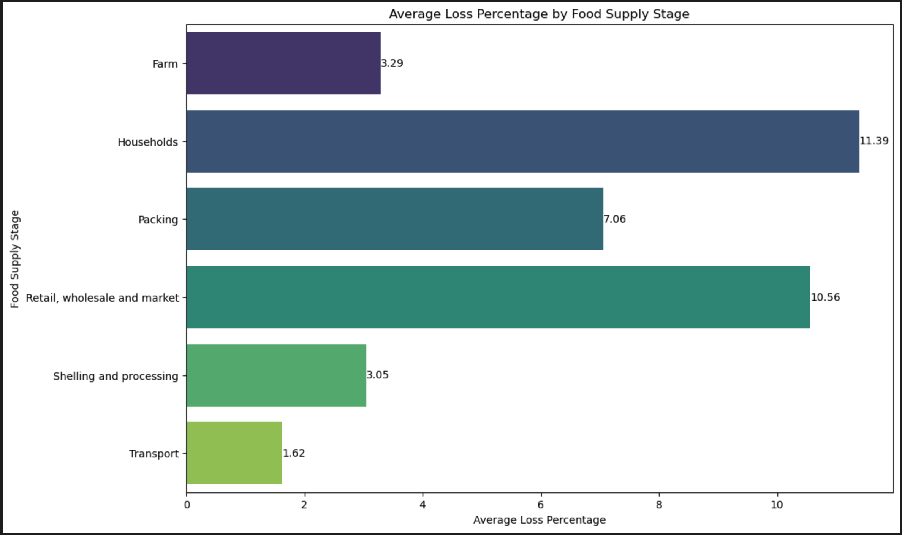
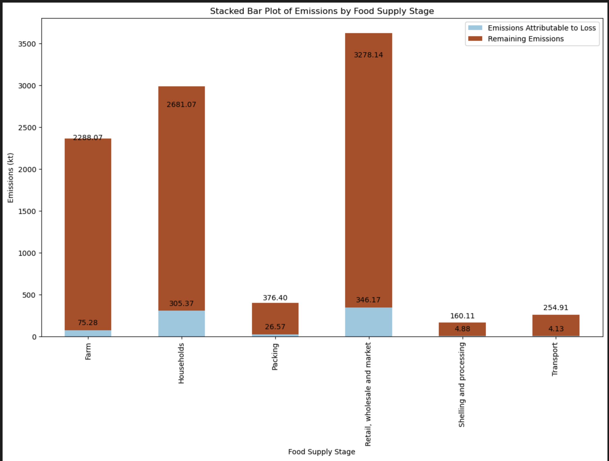
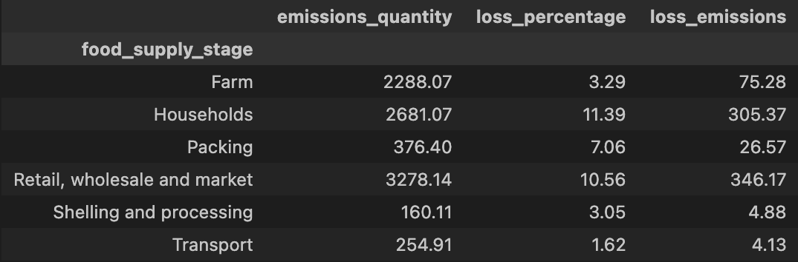
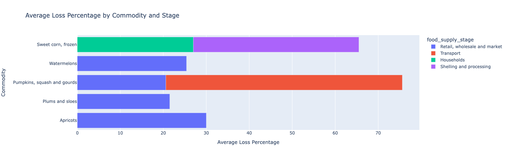
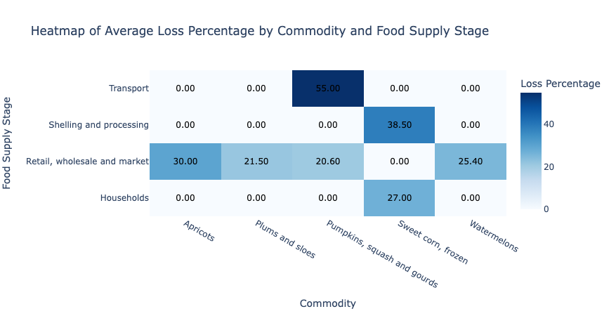
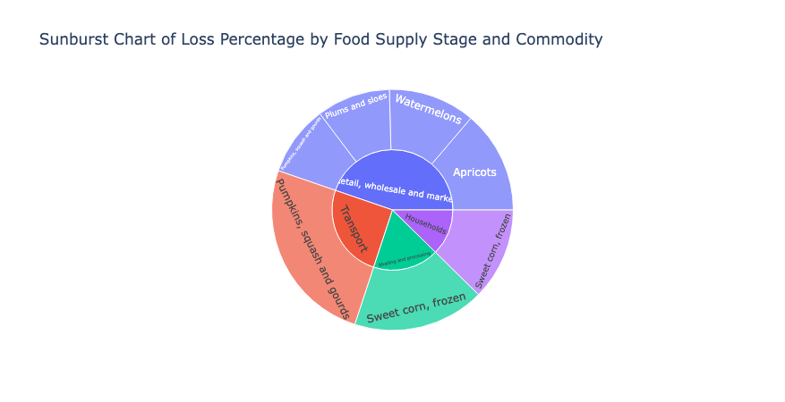
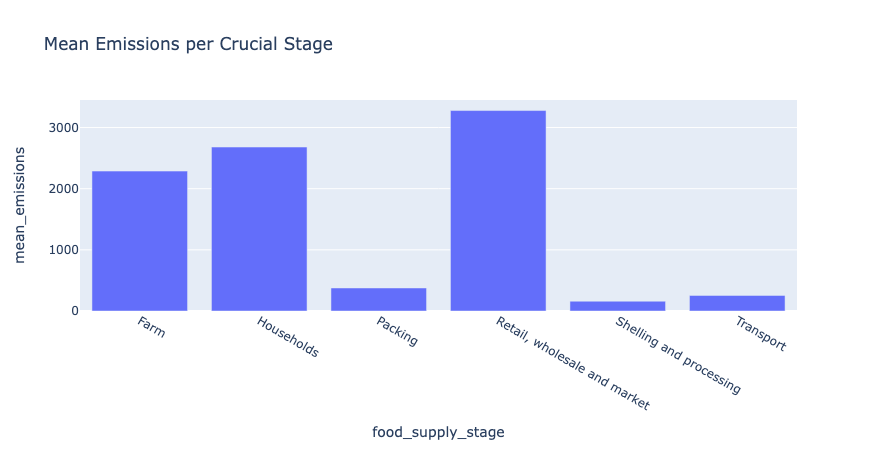
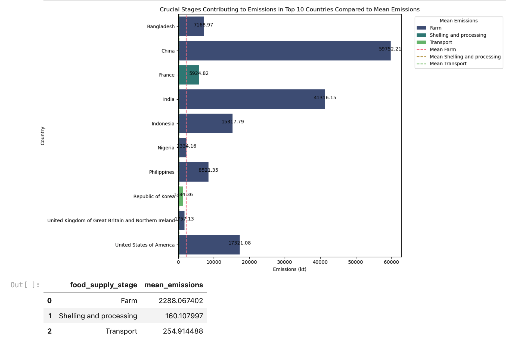

# The Impact of Food Waste and Emissions on the Environment :herb:

## Table of Contents

- [Project Context](#project-overview)
- [Introduction](#introduction)
- [Hypotheses](#hypotheses)
- [Visualizations](#visualizations)
- [Datasets used and useful links](#datasets-used-and-useful-links)

### Project Context:

- The global food supply chain is a complex system that involves various stages from production to consumption. Each stage of the supply chain, including farming, processing, transportation, retail, and consumption, is associated with food loss and waste. This wastage not only represents a loss of valuable resources but also contributes significantly to greenhouse gas emissions, impacting the environment and sustainability efforts.

### Introduction:

- This project aims to tackle the critical issue of food waste and emissions throughout the food supply chain. By addressing food waste, we can make significant strides in reducing environmental impact, conserving resources, improving food security and fighting worldwide hunger.

- The main objective is to identify critical stages in the food chain where interventions can significantly reduce waste and emissions, thereby enhancing sustainability practices within the industry.

## Hypotheses :bulb:

**1️⃣ Hypothesis**
- Retail and wholesales market activities are the value chain stage that most contribute to food loss and corresponding emissions;

**2️⃣ Hypothesis**
- Different commodities experience varying loss percentages across different stages of the food supply chain, indicating potential inefficiencies specific to each stage;

**3️⃣ Hypothesis**
- Emissions reduction potential by targeting specific supply chain stages-

## Visualizations :chart_with_upwards_trend: 

### **EDA - 1️⃣ Hypothesis**

### **EDA - 2️⃣ Hypothesis**

### **EDA - 3️⃣ hypothesis**

### Datasets used and useful links 

- [Food Waste FAO dataset](https://www.fao.org/platform-food-loss-waste/flw-data/en/)
- [Emissions FAO dataset](https://www.fao.org/faostat/en/#data/GT)
- [Notion Project Management](https://cactus-burrito-0dd.notion.site/The-Impact-of-Food-Waste-and-Emissions-on-the-Environment-aadb3a283d5743d09389e524ca726f27)
- [Project Presentation Google Slides](https://docs.google.com/presentation/d/19tk_YzKpnB7Ru_O-JEV524FCq9pPl2yMXOzMO9t66sM/edit?usp=sharing)
- [Alexandre Ribeiro Linkedin](https://www.linkedin.com/in/alexandre-ribeiro-264445279/) :man_cook:
- [José Pedro Brandão Linkedin](https://www.linkedin.com/in/jos%C3%A9-pedro-barbosa-brand%C3%A3o-663a172b6/) :man_cook:

